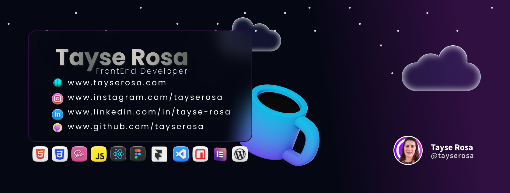

<h1 align="center">Barber Template <h1>

### Projeto online
https://barber-template.tayserosa.com/

🟢 Status do projeto: concluído:

  

  
## Projeto online
Acesse [aqui.](https://barber-template.tayserosa.com/)

## :memo: Licença
Esse projeto está sob a licença MIT. Veja o arquivo [LICENSE](LICENSE.md) para mais detalhes.

## 📫 Contribuindo para Projeto

Para contribuir com Projeto, siga estas etapas:

1. Bifurque este repositório.
2. Crie um branch: `git checkout -b <nome_branch>`.
3. Faça suas alterações e confirme-as: `git commit -m '<mensagem_commit>'`
4. Envie para o branch original: `git push origin <nome_do_projeto> / <local>`
5. Crie a solicitação de pull.

Como alternativa, consulte a documentação do GitHub em [como criar uma solicitação pull](https://help.github.com/en/github/collaborating-with-issues-and-pull-requests/creating-a-pull-request).

Copyright :copyright: 2024 · Desenvolvido por 💜 Tayse Rosa        
